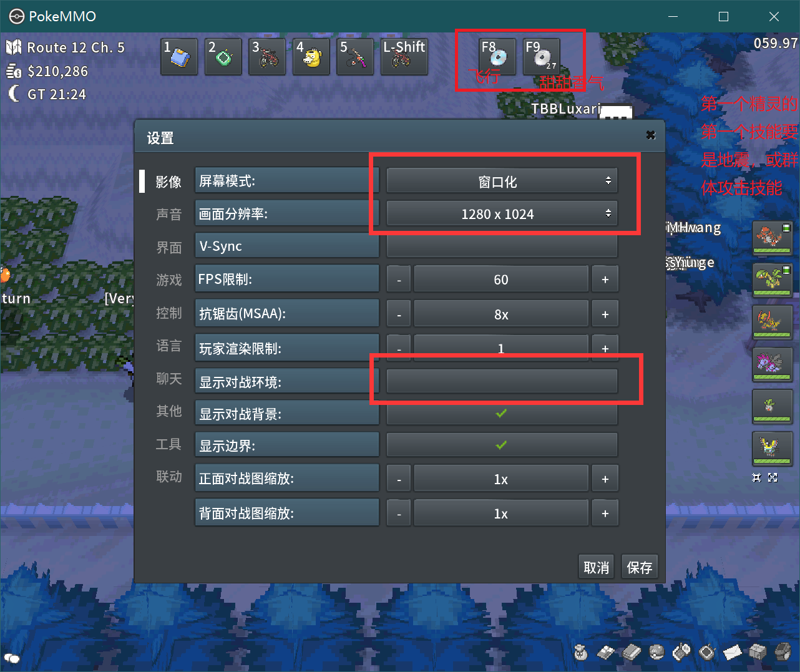
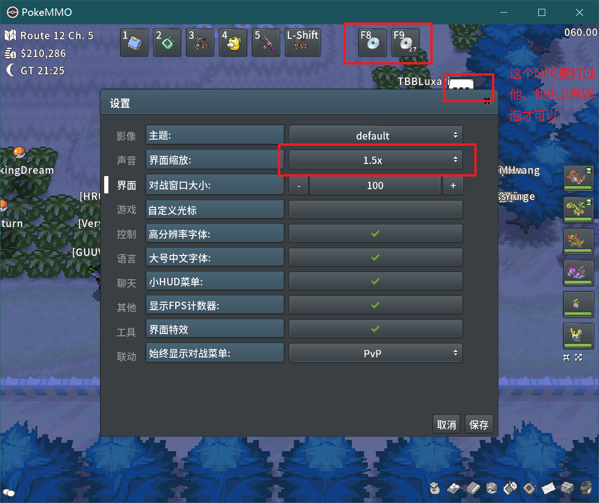

# PokemmoExp
Pokemmo全自动屠马 刷经验

## 用法

游戏安装高清mod

窗口模式，分辨率为1280*1024

显示对战环境取消勾选

界面缩放 1.5X	

快捷栏8 放飞行技能

快捷栏9 放甜甜香气技能

第一只精灵的第一个技能为地震(或其他范围攻击技能)

需要身上精灵学习飞行和甜甜香气(pp升到最高)

要升级的精灵带学习装置

屠马厂右上方图中圈出来的NPC要打过他， 他头上要冒气泡才可以

点击程序的 自动屠马 开始刷

## Win10 64位注册dm.dll

将`dm.dll`复制到 `C:\Windows\System32` 和 `C:\Windows\SysWOW64` 下，然后管理员身份运行 `注册大漠插件到系统.bat` 即可注册成功

## Todo

优化代码

闪光判定

## about
Pokemmo  https://pokemmo.eu/

[Pokemmo高清Mod](https://forums.pokemmo.eu/index.php?/topic/111790-mod-ta-%E9%AB%98%E6%B8%85-%E6%99%AE%E9%80%9A%E9%97%AA%E5%85%89%E6%AD%A3%E9%9D%A2%E6%99%AE%E9%80%9A%E8%83%8C%E9%9D%A2-%E6%89%8B%E6%9C%BA%E7%89%88/)

xDm https://github.com/xxxxue/xDM